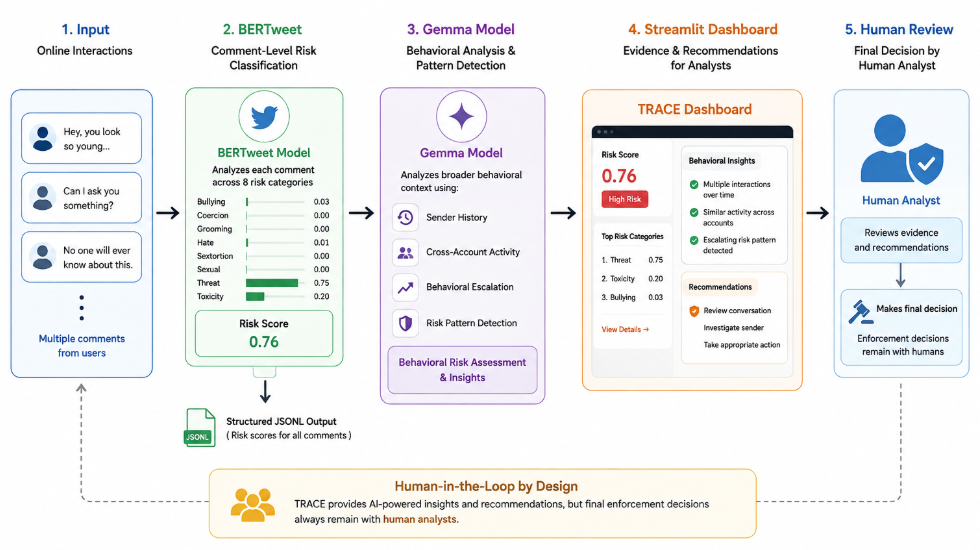

# TRACE-AI-Early-Warning-System
AI-powered early-warning system designed to help Trust & Safety teams identify potentially harmful behavioral patterns targeting children before they escalate.

Developed during the **USAII Global AI Hackathon - Graduate & Doctoral Track**, under the **AI for Systems & Society → Human Safety and Protection** challenge.

**Reached the Final Round**

---

## Why We Built TRACE

Online harmful behavior is not always visible from a single comment.

A comment that looks harmless on its own can become more concerning when combined with previous interactions, repeated behavior, or activity across different accounts.

TRACE was designed to look beyond individual comments by combining **comment-level risk classification** with **behavioral context**.

The system provides evidence-based recommendations to human analysts rather than making automatic enforcement decisions.

---

## How TRACE Works

TRACE combines three main components:

- **BERTweet** : analyzes comments across eight risk categories
- **Gemma** : analyzes sender history, cross-account activity, and behavioral escalation
- **Streamlit Dashboard** : presents the analysis and recommendations to human analysts

---

## My Contribution

My primary contribution was the **BERTweet-based comment classification component**.

I worked on:

- Fine-tuning BERTweet for eight risk categories
- Configuring and running the training process
- Evaluating the model using Macro F1
- Generating prediction outputs
- Saving predictions in JSONL format
- Sharing the structured outputs with the team for integration

The BERTweet component provided comment-level risk information for the rest of the TRACE pipeline.

---

## Project Demo

[▶️ Watch the TRACE Demo on YouTube](https://youtu.be/SncKkpuTF6M?si=P0fCzxzNv-TJVoNj)

---

## Detailed Documentation

- [Project Overview](docs/project_overview.md)
- [BERTweet Model & My Contribution](docs/bertweet_model.md)
- [System Workflow](docs/system_workflow.md)
- [Results & Demo](docs/results_and_demo.md)

---

## Hackathon

TRACE was developed as a team project during the USAII Global AI Hackathon(2026) and reached the **final round**.

The project gave our team practical experience in:

- Natural Language Processing
- Transformer-based classification
- Responsible AI
- Explainable AI
- Human-in-the-loop systems

---

## Responsible AI

TRACE is designed as a **decision-support system**. Final enforcement decisions remain with human analysts.
